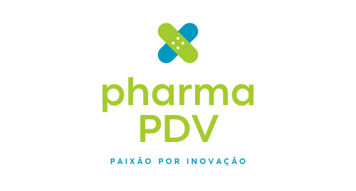
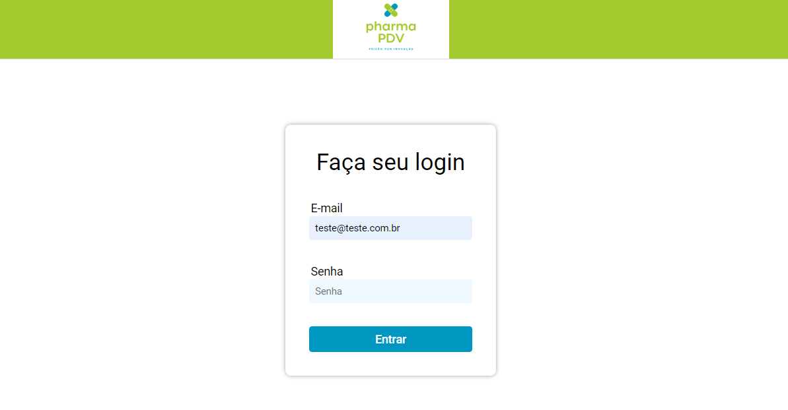
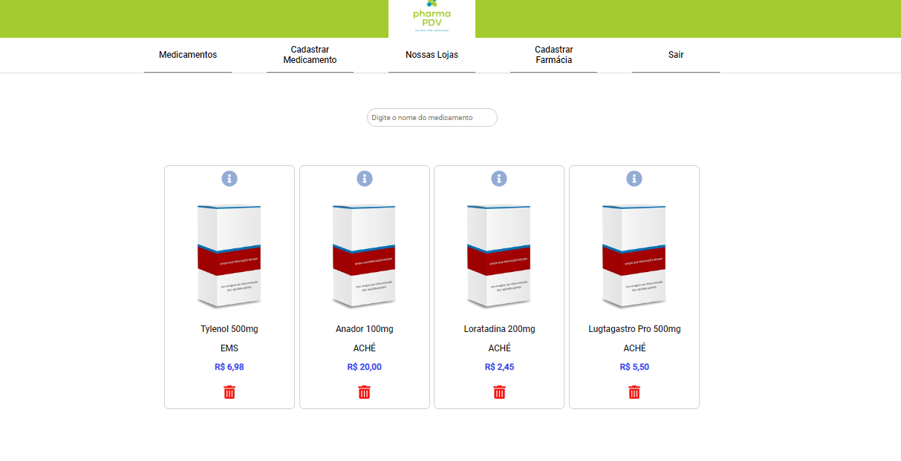
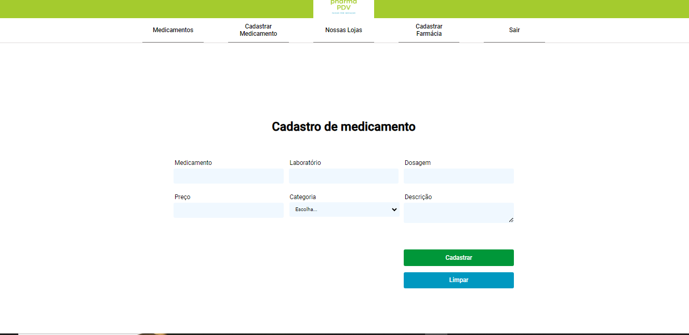
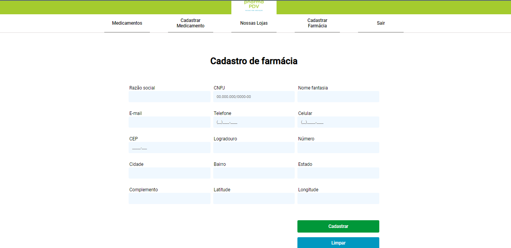
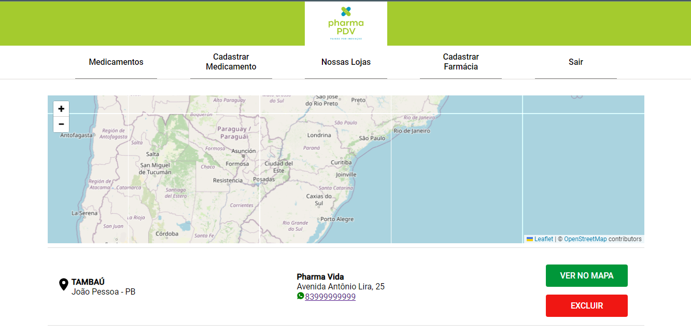

<p align="center">
  <a href="https://pharma-pdv.vercel.app/" target="blank"></a>
</p>

# <p align="center">Pharma PDV</p>

<p align="center">
 <a href="#-sobre-o-projeto">Sobre</a> •
 <a href="#-funcionalidades">Funcionalidades</a> •
 <a href="#-como-executar-o-projeto">Como executar</a> • 
 <a href="#-documentação">Documentação</a> • 
 <a href="#-tecnologias">Tecnologias</a> • 
 <a href="#-autor">Autor</a> • 
 <a href="#user-content--licença">Licença</a>
</p>

## 💻 Sobre o projeto

[Pharma PDV](https://pharma-pdv.vercel.app/) é um sistema para gerenciamento de medicamentos e cadastramento de farmácias.

## ⚙️ Funcionalidades

- [x] Realização de login utilizando e-mail e senha
- [x] Cadastro de farmácias
- [x] Cadastro de medicamentos
- [x] Listagem de medicamentos cadastrados
- [x] Pesquisa de medicamentos por palavra-chave
- [x] Listagem de farmácias cadastradas
- [x] Visualização de mapa de farmácias
- [x] Persistência dos dados no local storage
- [x] Logout
---

## 🚀 Como executar o projeto

### Pré-requisitos

Antes de começar, você vai precisar ter instalado em sua máquina as seguintes ferramentas:
[Git](https://git-scm.com), [NodeJS](https://nodejs.org/en/),
Além disto é bom ter um editor para trabalhar com o código como o [VSCode](https://code.visualstudio.com/).

### Fazendo download do projeto

Abra um terminal no VSCode e insira o comando abaixo

```bash
$ git clone https://github.com/patriciagrocha/pharma-pdv
```

### Configurando variáveis de ambiente

Para configurar as variáveis de ambiente você deverá renomear o arquivo ".env_example" contido na pasta raiz do projeto para ".env" e alterar os dados de acordo com as informações de utilização da API [Brasil API](https://brasilapi.com.br/)

```
VITE_REACT_APP_BRASIL_API = "link para acesso ao Brasil API"
```
### 🎲 Rodando o Projeto

```bash

# instalação das dependências
$ npm install

# executando o projeto em modo desenvolvimento (insira no seu navegador o link http://localhost:5173/)
$ npm run dev

```

## 🧭 Funcionamento do sistema
Se preferir você pode testar as funcionalidades do projeto através do link do [deploy](https://pharma-pdv.vercel.app/)  

### Página de Login



### Lista de Medicamentos



### Cadastro de Medicamentos



### Cadastro de Farmácias



### Nossas Lojas



---
## 🛠 Tecnologias

| Ferramenta | Descrição |
| --- | --- |
| `ReactJS` | framework web|
| `Vite` | gerador de projeto de front-end|
| `npm` | gerenciador de pacotes| |
| `Styled Components` | Ferramenta para ter mais produtividade ao estilizar a aplicação|
| `React-icons` | Dependência com ícones super legais|
| `React router dom` | Dependência para criar rotas no reactjs|
| `React hook form` | Dependência para auxiliar na organização e padronização das validações dos formulários  reactjs|
| `React toastify` | Dependência para exibir mensagem de notificação no reactjs|
| `React Leaflet` | Ferramenta de geolocalização para exibicação de mapa|
| `Yup` | Dependência para validações de dados no reactjs|
| `Axios` | Dependência para consumir api|
| `Trello` |Ferramenta para gerenciamento de projetos|
| `Vercel` | Hospedagem para a aplicação, deploy integrado com o github|
| `Github` | Hospedagem do código fonte integrado com gerenciador de versionamento|

<br />

## Autora
 <b>Patrícia Rocha</b>🚀
 <br />
[](https://www.linkedin.com/in/patriciagrocha/) 

---
## 📝 Licença

Este projeto está sob a licença [MIT](./LICENSE).
